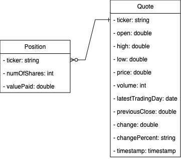

# Stock Quote App

The **Stock Quote App** is a command-line application that allows users to manage a simulated stock portfolio. Users can retrieve **real-time stock data**, view their positions, and execute buy/sell transactions. The application integrates with the **Alpha Vantage API** to fetch live stock quotes and uses **PostgreSQL** for portfolio data persistence. It follows a **modular architecture**, leveraging **JDBC** for database connectivity and **Log4j** for logging. The project follows the **DAO design pattern** to maintain separation between business logic and data access.

## Technologies Used

The application is built using the following technologies:

- **Java 11+**
- **Maven**
- **JDBC**
- **DAO Pattern**
- **PostgreSQL**
- **JUnit & Mockito** (for testing)
- **Jackson JSON Parser**
- **okhttp3** (for HTTP requests)
- **Alpha Vantage API** (for real-time stock data)
- **Log4j** (for logging)
- **Docker** (for containerization)

## Quick Start

### Prerequisites

Ensure the following are installed:

- **Java 11+**
- **Maven**
- **PostgreSQL**
- **Docker** (optional for running the database container)

### Setting Up the PostgreSQL Database

Run the following commands to set up the PostgreSQL database:

```bash
# Pull the PostgreSQL Docker image
docker pull postgres

# Create a persistent data directory
mkdir -p ~/srv/postgres

# Run the PostgreSQL container
docker run --rm --name stockquote -e POSTGRES_PASSWORD=password -d -v $HOME/srv/postgres:/var/lib/postgresql/data -p 5432:5432 postgres

# Create the database
psql -h localhost -U postgres -f sql/database.sql

# Insert required tables
psql -h localhost -U postgres -d stock_quote -f sql/stockquote.sql
```

Next, update the configuration file:

Modify src/main/resources/properties.txt with your database credentials.

Add your Alpha Vantage API key in the properties file.

## Running the Application Locally

```bash
# Build the project
mvn clean compile

# Run the application
Main.java
```

## Implementation

### Entity Relationship Diagram



### Application Layers & Design Patterns

The application follows a layered architecture with a separation of concerns:

#### Controller Layer

- Handles user input and delegates business logic to the Service layer.

#### Service Layer

- Contains business logic and validation.
- Ensures proper stock transactions before interacting with the database.

#### DAO Layer (Data Access Object)

- Manages database interactions.
- Implements CRUD (Create, Read, Update, Delete) operations.

#### Helper Layer

- Includes utilities such as API integration (`QuoteHttpHelper`).
- Parses JSON data using Jackson.

### Repository Design Pattern

- Acts as an abstraction for data persistence.
- Works alongside the DAO pattern to fetch stock data.

## Testing

### Unit Testing

The project uses JUnit and Mockito for unit testing, covering:

- **Service Layer**: Ensures proper stock buying/selling logic.
- **DAO Layer**: Validates database CRUD operations using mocked interactions.

### Integration Testing

Integration tests verify real database interactions by:

- Fetching stock data from the Alpha Vantage API.
- Performing buy/sell transactions and validating database updates.
- Using a separate test database with transactional rollbacks to prevent contamination.

# Deployment
To containerize your own version of the app, follow these steps:

```bash
# Ensure Docker is running on background
# Build the Docker image and tag (change user, appname, tag(e.g., latest))
docker build -t username/appname:tag .

# Log in to Docker registry
docker login

# Push the image to the registry (change user, appname, tag(e.g., latest))
docker push username/appname:tag

# Pull the image from the registry
docker pull username/appname:latest

# To run the Docker container in interactive mode and allow terminal input, use the following command
docker run -it appname
```

Alternatively, for convenient access and usage, the image can be pulled from Docker hub.
```bash
# Pull the image from DockerHub
docker pull piyushs8e/stockquote
```

## Future Enhancements

- Web-based UI for better user experience.
- User authentication for secure portfolio management.
- Real-time stock updates for accurate tracking.
- Portfolio balance simulation to limit user purchases.
- API rate limiting to handle request restrictions from Alpha Vantage.
