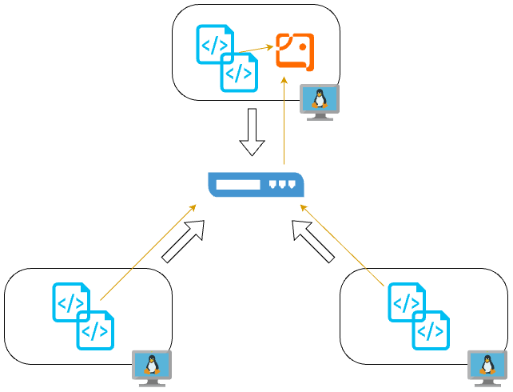

# Linux Cluster Monitoring Agent

# Introduction
The Linux Cluster Monitoring Agent Project monitors and manages a cluster of Linux nodes/servers. Using scripts, the system captures hardware specifications and real time CPU and memory usage within multiple nodes within the cluster. The data is then stored in a PostgreSQL database for analysis and performance tracking. We utilize technologies such as Bash, Docker, PostgreSQL, Git, GitHub and cron. 

# Quick Start
Use markdown code block for your quick-start commands
- Start a psql instance using psql_docker.sh           
```
(bash -x) ./scripts/psql_docker.sh create db_username db_password
./scripts/psql_docker.sh start
```
- Create tables using ddl.sql  
`psql -h localhost -U postgres -d host_agent -f sql/ddl.sql`
- Insert hardware specs data into the DB using host_info.sh
`(bash -x)./scripts/host_info.sh psql_host psql_port db_name psql_user psql_password`
- Insert hardware usage data into the DB using host_usage.sh
`(bash -x)./scripts/host_usage.sh psql_host psql_port db_name psql_user psql_password`
- Crontab setup        
```
crontab -e
* * * * * /path/to/scripts/host_usage.sh psql_host psql_port db_name psql_user psql_password
```

# Implemenation
The architecture consists of three Linux hosts running Bash agent scripts (host_info.sh and host_usage.sh), a PostgreSQL database hosted in Docker, and communication via internal networking. The host_info.sh script captures static hardware data, while host_usage.sh collects dynamic usage data at regular intervals.
## Architecture


## Scripts
Shell script description and usage (use markdown code block for script usage)
- psql_docker.sh
Manages the PostgreSQL Docker container (create, start, stop).
```
./scripts/psql_docker.sh create [username] [password]
./scripts/psql_docker.sh start
./scripts/psql_docker.sh stop
```
- host_info.sh
Captures static hardware specifications of the node and inserts them into the database.
`./scripts/host_info.sh [host] [port] [database] [username] [password]`
- host_usage.sh
Collects real-time CPU and memory usage and inserts it into the database.
`./scripts/host_usage.sh [host] [port] [database] [username] [password]`
- crontab
Automates the execution of host_usage.sh to run every minute.      
`* * * * * /path/to/scripts/host_usage.sh psql_host psql_port db_name psql_user psql_password`
- queries.sql                                                                    
Contains SQL queries to extract insights, such as average CPU/memory usage or identifying underperforming nodes.

## Database Modeling
Describe the schema of each table using markdown table syntax (do not put any sql code)                
`host_info`                                                      
| Column Name        | Data Type | Description                          |                                  
|--------------------|-----------|--------------------------------------|                                    
| `id`               | SERIAL    | Primary key, unique host identifier. |                                
| `hostname`         | VARCHAR   | Hostname of the server.              |                                    
| `cpu_number`       | INT       | Number of CPUs.                      |                                      
| `cpu_architecture` | VARCHAR   | CPU architecture (e.g., x86_64).     |                                  
| `memory_total`     | INT       | Total memory in MB.                  |                                
| `timestamp`        | TIMESTAMP | Time of data collection.             |                                      

`host_usage`                                                                        
|     Column     | Data Type |            Description            |                                
|:--------------:|:---------:|:---------------------------------:|                            
| timestamp      | TIMESTAMP | Timestamp of data collection      |                            
| host_id        | INT       | Foreign key referencing host_info |                                
| memory_free    | INT       | Free memory in MB                 |                              
| cpu_idle       | INT       | CPU idle percentage               |                                    
| cpu_kernel     | INT       | CPU kernel usage percentage       |                                  
| disk_io        | INT       | Disk IO                           |                                  
| disk_available | INT       | Available disk space in MB        |                                  

# Test
Each Bash script was tested by running it with valid and invalid inputs, confirming that the expected data was correctly inserted into the PostgreSQL tables. The DDL commands were tested by recreating the tables in a fresh environment. Validation was done by querying data in host_usage and host_info.
        
# Deployment
This project was deployed using Docker to manage the PostgreSQL instance and Crontab for scheduling automated tasks. Scripts are version-controlled using Git and organized within a directory structure.


# Improvements
Write at least three things you want to improve 
e.g. 
- Update Hardware Specs:
Since we only run host_info once, any change to the hardware specifications are not accounted for and therefore, Implementing automated detection and periodic updates for changed hardware specs would ensure data consistency.
- Creating a Dashboard:
Creating a user-friendly frontend dashboard for visualizing resource usage trends over time will help make decisions and provide a visual representation for better understanding. 
- Using Docker Compose:
Is an excellent way to simplify the deployment of your project by allowing you to manage multiple services using a single YAML configuration file. 
